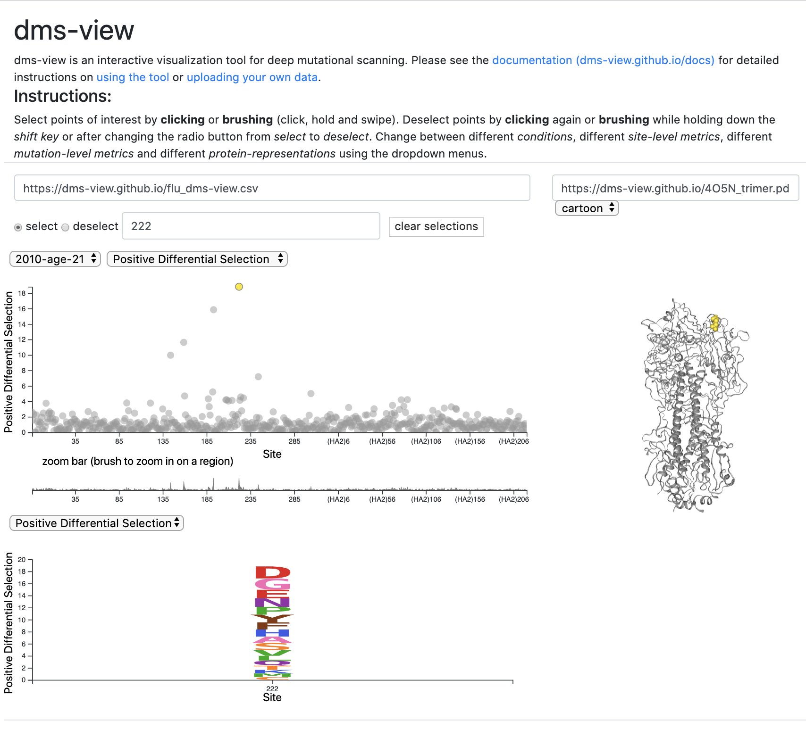

# [`dms-view`](https://dms-view.github.io)

Sarah Hilton\*, John Huddleston\*, Allison Black, Khrystyna North, Adam Dingens, Trevor Bedford, and Jesse Bloom.   
(* equal contribution)  

[`dms-view`](https://dms-view.github.io) is an interactive visualization tool for deep mutational scanning experiments.
You can find the tool at [`dms-view.github.io`](https://dms-view.github.io).

This repo contains the JavaScript and D3 code to run the tool itself.
For information on how to use the tool, please see the [documentation](https://dms-view.github.io/docs).

Please raise issues with the tool at [`github.com/dms-view/dms-view.github.io/issues`](https://github.com/dms-view/dms-view.github.io/issues).

## Organization

There are two categories of files in this repo: code to run the website and default data.

### (1) code to run the website

#### website skeleton and styles
- [`index.html`](index.html): The HTML skeleton of the tool.
- [`styles.css`](styles.css): CSS styles for the website.

#### JavaScript / D3 for the plots
- [`main.js`](main.js): Control script for data processing and JavaScript code for the three panels.
- [`line_plot_zoom.js`](line_plot_zoom.js): JavaScript and D3 code for the site dot plot panel.
- [`logoplot.js`](logoplot.js): JavaScript and D3 code for the mutation logoplot panel.
- [`prot_struct.js`](prot_struct.js): JavaScript and [NGL](http://nglviewer.org/ngl/api/manual/) code for the protein structure panel.

#### external packages and files
- [`DejaVuSansMonoBold_SeqLogo.ttf`](DejaVuSansMonoBold_SeqLogo.ttf): font for the mutation logoplot panel. More info on the font [HERE](https://github.com/jbloomlab/dmslogo/tree/master/dmslogo/ttf_fonts).
- [`node_modules/`](node_modules/): External JavaScript modules.
- [`ngl.js`](ngl.js): [NGL](http://nglviewer.org/ngl/api/manual/) module code.

### (2) default data

If [`dms-view.github.io`](https://dms-view.github.io) is loaded without datafiles specified in the URL, influenza serum mapping data from [Lee _et al.,_ 2019](https://elifesciences.org/articles/49324) is loaded by default.
For more information on how to create the data files, see [`dms-view.github.io/docs/dataupload`](https://dms-view.github.io/docs/dataupload).

- [`flu_dms-view.csv`](flu_dms-view.csv): [data file](https://dms-view.github.io/docs/dataupload/#data-file)
- [`4O5N_trimer.pdb`](4O5N_trimer.pdb): [protein structure file](https://dms-view.github.io/docs/dataupload/#protein-structure)
- [`lee2019mapping.md`](lee2019mapping.md): [metadata file](https://dms-view.github.io/docs/dataupload/#metatdata-file)

## external dependencies

- [d3 v5](https://d3js.org/d3.v5.min.js)
- [d3 array v2](https://d3js.org/d3-array.v2.min.js)
- [underscore v1.9.1](https://cdnjs.cloudflare.com/ajax/libs/underscore.js/1.9.1/underscore-min.js)
- [opentype v1.1.0](https://cdn.jsdelivr.net/npm/opentype.js@1.1.0/dist/opentype.min.js)
- [min v0.8.2](https://cdn.jsdelivr.net/npm/marked@0.8.2/marked.min.js)
- [bootstrap v4.3.1](https://stackpath.bootstrapcdn.com/bootstrap/4.3.1/css/bootstrap.min.css)

The other dependencies are hosted within the repo.

## testing

As described above, [`dms-view`](https://dms-view.github.io) uses a default dataset from [Lee _et al.,_ 2019](https://elifesciences.org/articles/49324).
Below are two descriptions of different combinations of dropdown menus and selected sites, as well as pictures of what the tool should look like.

### view 1 (default view)
When [`dms-view.github.io`](https://dms-view.github.io) is loaded, the default view of the data section should look as follows:

Click [HERE](https://dms-view.github.io/?markdown-url=https%3A%2F%2Fdms-view.github.io%2Flee2019mapping.md&data-url=https%3A%2F%2Fdms-view.github.io%2Fflu_dms-view.csv&condition=2010-age-21&site_metric=site_Positive+Differential+Selection&mutation_metric=mut_Positive+Differential+Selection&selected_sites=222&pdb-url=https%3A%2F%2Fdms-view.github.io%2F4O5N_trimer.pdb) to see this example.

### view 2
The data section should look as follows when you change
- condition to "2009-age-65"
- mutation metric to "Natural Frequencies"
- selected sites 144, 159, 192, 193, 222, 224

Click [HERE](https://dms-view.github.io/?markdown-url=https%3A%2F%2Fdms-view.github.io%2Flee2019mapping.md&data-url=https%3A%2F%2Fdms-view.github.io%2Fflu_dms-view.csv&pdb-url=https%3A%2F%2Fdms-view.github.io%2F4O5N_trimer.pdb&selected_sites=144%2C159%2C192%2C193%2C222%2C244&condition=2009-age-65&site_metric=site_Positive+Differential+Selection&mutation_metric=mut_Natural+Frequencies) to see this example

### other views

In the documentation, we use [`dms-view`](https://dms-view.github.io) to recreate paper figures for two different studies.
Please see [dms-view.github.io/docs/casestudies](https://dms-view.github.io/docs/casestudies) to see these examples
